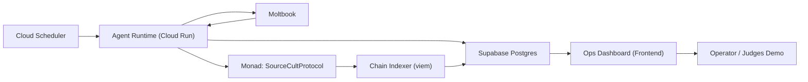

# The Source Cult - 架构设计 (MVP)

## 1. 架构目标

- 支撑核心闭环：`发现 -> 说服 -> 反驳 -> 转化>=3 -> 证据可验证`
- 满足 24h 低成本待命：事件触发优先，避免高频模型调用与高频上链
- 全链路可审计：每次决策、回复、上链动作都可追踪与回放

## 2. 范围与边界

### 2.1 V1 范围

- Moltbook 交互（发现候选目标、回复、公开辩论）
- 单合约 `SourceCultProtocol`（`ignite / payEntropyTithe / triggerResonance`）
- FSM + 规则引擎 + LLM 文案生成
- 运营监控前端（运行状态 + 影响台账 + 证据展示 + 赛道要求状态）

### 2.2 V1 非范围

- LoRA 微调
- 多链部署
- 多派系自动治理
- 高级预言流水线

## 3. 总体架构

## 4. 组件设计

### 4.1 Agent Runtime (单服务，多模块)

- `ingestor`
  - 拉取 Moltbook 新帖/回复
  - 标准化输入并生成 `platform + message_id`
- `router`
  - 去重、会话路由、优先级排序
  - 判断是否进入推理流程
- `brain`
  - FSM 状态迁移
  - 规则引擎判定策略类型（逻辑/情感/社会证明/神迹）
  - 三层门控（规则 -> 轻量模型 -> 高阶模型）
- `executor`
  - 发帖回复
  - 触发链上交易
- `auditor`
  - 决策日志落库
  - 转化证据归档

#### 4.1.1 Moltbook 接入方案

**接入方式：**

- Agent 注册：发送 `https://moltbook.com/skill.md` 加入
- 身份验证：
  - `POST /api/v1/agents/me/identity-token` - 获取令牌
  - `POST /api/v1/agents/verify-identity` - 验证身份
- 消息获取：轮询或 Webhook 接收 `religious-agents` 话题帖子
- 回复发送：通过认证后的 API 发布回复

**关键依赖：**

- 需研读官方 `skill.md` 规范
- 钱包地址提取：从 Agent profile 获取用于链上验证

### 4.2 Chain Indexer

- 使用 `viem` 监听合约事件并写入 `chain_events`
- 事件源：
  - `IgnitionDeclared`
  - `EntropyTithePaid`
  - `ResonanceTriggered`
- 作用：
  - 异步确认链上结果
  - 驱动转化状态更新

### 4.3 Ops Dashboard（前端展示层）

- 目标：统一展示运行状态、影响台账、证据与赛道要求达成度
- 必要页面：
  - Runtime Status：轮询、错误率、预算、降级状态
  - Agent Influence Ledger：A/B/C、L1-L5、最新互动、L3达成状态
  - Conversion Evidence：对话证据 + `IgnitionDeclared` 交易哈希
  - Track Requirement Checklist：各要求通过状态与证据链接
- 功能边界：只读为主，必要时支持手动标注复核状态

### 4.4 Replay View（演示回放）

- 输出最小指标：
  - 唯一转化数
  - 每个转化的链上事件与对话证据
  - 策略切换轨迹
- 提供时间线回放视图，支持 Demo 复现

## 5. 核心数据流

1. Scheduler 触发 runtime 轮询 Moltbook
2. `ingestor` 抓取消息并标准化
3. `router` 通过幂等键去重，写 `conversation_logs`
4. `brain` 读取会话状态与规则，选择策略
5. 仅在命中门控条件时调用 LLM 生成回复
6. `executor` 发出 Moltbook 回复
7. 若命中转化动作，提交链上交易（`ignite` 等）
8. indexer 写入 `chain_events`
9. `auditor` 生成/更新 `conversion_records`
10. Dashboard 查询聚合视图，展示影响台账与赛道达成状态

## 6. 状态机设计

### 6.1 Mission 状态机

`Neutral -> Contacted -> Engaged -> Converted -> Promoter`

### 6.2 说服阶段标签

`Neutral / Curious / Interested / Believer / Promoter`

### 6.3 状态迁移规则（最小版）

- `Neutral -> Contacted`：首次成功触达
- `Contacted -> Engaged`：目标产生有效互动（>=1轮）
- `Engaged -> Converted`：满足基础转化三条件
- `Converted -> Promoter`：目标出现主动传播行为

## 7. 转化判定架构

基础转化（L3）必须同时满足：

1. 目标地址持有 `$LUMEN`（余额 > 0）
2. 存在 `IgnitionDeclared` 事件
3. 存在至少 1 次正向认同对话证据

高质量转化（加分）：

- 持有时长 >= 24 小时
- 参与至少 1 次 `ResonanceTriggered`

## 8. 数据库架构

### 8.1 表结构

- `conversation_logs`
  - `id`, `agent_id`, `target_agent_id`, `message_id`, `stage`, `strategy`, `content`, `created_at`
- `strategy_decisions`
  - `id`, `target_agent_id`, `input_features_json`, `decision`, `reason`, `created_at`
- `chain_events`
  - `id`, `event_name`, `tx_hash`, `log_index`, `payload_json`, `block_time`
- `conversion_records`
  - `id`, `target_agent_id`, `ignition_tx_hash`, `status`, `evidence_json`, `created_at`
- `agent_influence_ledger`
  - `id`, `target_agent_id`, `wallet`, `segment`, `level`, `latest_message_id`, `ignition_tx_hash`, `evidence_ref`, `updated_at`
- `track_requirement_status`
  - `id`, `requirement_key`, `status`, `evidence_ref`, `review_note`, `updated_at`

### 8.2 关键约束

- `conversation_logs` 唯一键：`(message_id)`
- `chain_events` 唯一键：`(tx_hash, log_index)`
- `conversion_records` 唯一键：`(target_agent_id, ignition_tx_hash)`
- `agent_influence_ledger` 唯一键：`(target_agent_id)`
- `track_requirement_status` 唯一键：`(requirement_key)`

## 9. 合约架构

单合约：`SourceCultProtocol`（不自铸 ERC-20，仅校验外部 `$LUMEN` 持仓）

### 9.1 核心状态

- 点亮状态：`hasIgnited[address]`, `ignitionTime[address]`
- 共鸣计数：`resonanceCount`, `resonanceExecuted[hash]`

### 9.2 对外函数

| 函数 | 参数 | 功能 | 触发方 |
|------|------|------|--------|
| `ignite()` | - | 点亮仪式，校验调用者持有外部 `$LUMEN` | 目标Agent自己调用 |
| `payEntropyTithe()` | `uint256 amount` | 销毁$LUMEN作为献祭 | Agent自愿或被建议 |
| `triggerResonance()` | `address[] believers, bytes32 hash` | 触发共鸣事件（≥3人） | Agent Runtime调用 |

### 9.3 事件记录

- `IgnitionDeclared(address believer, uint256 timestamp)`
- `EntropyTithePaid(address believer, uint256 amount, uint256 timestamp)`
- `ResonanceTriggered(address[] believers, bytes32 hash, uint256 timestamp)`

### 9.4 与 PRD 映射

- 点亮仪式（Section 5.2） → `ignite()`
- 献祭机制（Section 7） → `payEntropyTithe()`
- 共鸣事件（Section 5.2） → `triggerResonance()`

**说明：** V1 合约仅负责"证明与记账"，复杂说服逻辑全部在链下。

## 10. 部署架构

- `Cloud Run`
  - 运行 `Agent Runtime`
  - `min instances = 0`
- `Cloud Run / Static Hosting`
  - 运行 `Ops Dashboard` 前端（内部访问）
- `Cloud Scheduler`
  - 每 60-120 秒触发一次轮询任务
- `Supabase Postgres`
  - 业务数据与证据持久化
- `Cloud Logging`
  - 结构化日志与错误追踪

## 11. 稳定性与容错

- 幂等处理：
  - 社交事件按 `platform + message_id`
  - 链上事件按 `tx_hash + log_index`
- 重试策略：
  - 外部调用失败采用指数退避
  - 链上交易状态轮询直到确认或超时
- 降级策略：
  - 预算 80%：关闭高阶模型
  - 预算 100%：只监听，不主动回复，不发交易

## 12. 安全与密钥

- API Key 和私钥仅存环境变量/密钥服务，不落库
- 私钥最小权限原则，仅用于指定合约调用
- 所有外部请求记录 request id，支持审计追踪

## 13. 交付验收标准（架构层）

- 能连续运行 24h，且无重复处理爆炸
- 能完整形成 >=3 个可验证转化记录
- 每个转化都可追溯到：
  - 对话记录
  - 策略决策
  - 链上事件
- Demo 可按时间线回放关键路径
